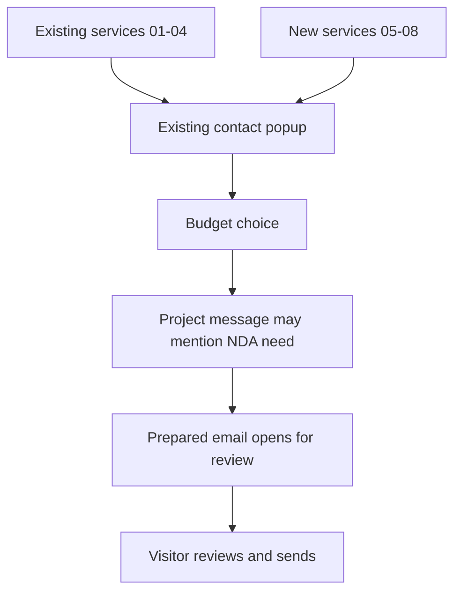
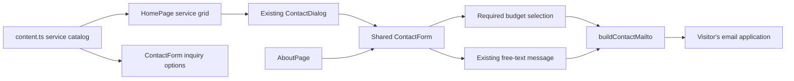

# Service Grid and Guided Inquiry Expansion - Plan

## Goal Capsule

- **Objective:** Expand the Expected End homepage from four to eight selected services and qualify service inquiries with a budget range before the visitor prepares an email.
- **Authority:** The Product Contract governs user-visible behavior and exact copy. The Planning Contract governs implementation choices. Existing repository conventions govern details not covered by either contract.
- **Open blockers:** None. Planning may choose implementation details, but it must not change the confirmed copy, ranges, choices, or no-upload boundary.
- **Execution profile:** Standard code change with two sequential implementation units. Use proof-first focused tests, then repository-wide checks and browser verification.
- **Stop conditions:** Stop and return to planning if implementation requires a backend, file input, browser storage, a new dialog, changed service names, changed budget options, or changed legal promises.
- **Tail ownership:** The executor owns focused tests, full checks, production build, responsive browser verification, accessibility checks, and removal of abandoned code. Deployment is outside this plan unless the user requests it separately.

---

## Product Contract

### Summary

The homepage will add a second row of four service cards for founders and small businesses. The existing contact popup will collect a budget range and tell visitors to mention in their message if an NDA is needed, then open the inquiry in their own email app for review.

### Problem Frame

The current service section explains four broad creative and technical capabilities, but it does not show founders that Expected End can build connected business tools, customer spaces, automations, or improvements to existing software. The current contact composer gathers project and timing details but leaves budget expectations and confidentiality needs to a later exchange.

### Actors

- A1. **Founder or small-business visitor:** Explores Expected End's services and prepares a project inquiry.
- A2. **Expected End owner:** Reviews the visitor's prepared inquiry after the visitor sends it and decides whether the work is a fit.
- A3. **Visitor's email application:** Opens the prepared message for review and sending.

### Key Decisions

- **Extend the existing service grid and popup.** (session-settled: user-directed — chosen over a new layout or second popup: the current experience already has the desired visual and interaction pattern.) Governs R1-R2, R7, R9.
- **Serve founders and small businesses first.** (session-settled: user-directed — chosen over established companies or creator-focused positioning: HeadQuarters and the supporting services are meant to give a growing business one capable technology partner.) Governs R2-R8.
- **Use the practical business-tools lineup.** (session-settled: user-directed — chosen over growth-focused and long-term-partner lineups: it communicates concrete value with the least overlap with the existing four services.) Governs R2-R7.
- **Start the budget choices at $100.** (session-settled: user-directed — chosen over a $250 floor and wider initial bands: the lower entry point welcomes smaller early-stage inquiries.) Governs R10-R11, R16.
- **Keep NDA handling simple.** (session-settled: user-directed — chosen over a separate NDA question, choices, attachment reminder, or upload flow: visitors only need to mention in their message if an NDA is needed.) Governs R12-R13.

### Requirements

**Service discovery**

- R1. Keep the existing cards 01 Apps, 02 Websites, 03 AI Systems, and 04 Creative in their current order and visual treatment.
- R2. Add a second row in this order: 05 HeadQuarters, 06 Automations, 07 Client Portals, and 08 Digital Rescue.
- R3. The HeadQuarters card uses this copy: “Your custom business home. CRM, finance, projects, team tools, and whatever capability you need next—all in one place.”
- R4. The Automations card uses this copy: “Replace repetitive work with connected workflows that keep your business moving.”
- R5. The Client Portals card uses this copy: “Give customers or members one polished place to communicate, book, share files, and track progress.”
- R6. The Digital Rescue card uses this copy: “Repair, modernize, or rebuild software that no longer works for your business.”
- R7. Selecting any new card opens the existing contact popup and preselects a matching inquiry reason.
- R8. The eight-card section remains keyboard-operable, retains visible focus, and follows the current responsive progression from four columns to two columns to one column without horizontal overflow.

**Guided inquiry**

- R9. Extend the existing contact popup and embedded contact experience instead of creating another dialog or form.
- R10. Add a required budget choice with exactly these options: $100-$1,000, $1,000-$2,000, $2,000-$10,000, $10,000-$50,000, and $50,000-$500,000+.
- R11. Present the budget choice as project context rather than a quote, guaranteed price, package, or promise that Expected End will accept the work.
- R12. Directly after “Our products come first. When the fit is right, we bring the same thoughtfulness to selected work for others.” add the concise guidance: “Please include a price range for all inquiries and mention in your message if an NDA is needed.”
- R13. Do not add a separate NDA field, choice list, upload control, attachment workflow, or extended NDA explanation.

**Prepared email and privacy**

- R16. The prepared email includes the selected service reason, budget range, and the existing contact fields in a clear labeled format; any NDA need is carried only in A1's free-text message.
- R17. Nothing reaches Expected End until A1 reviews the prepared message and sends it from A3.
- R18. Preserve the current source-parameter allowlist and do not introduce a website submission backend, analytics event, account, payment step, or browser storage for the new answer.

The confirmed page and inquiry shape is:

### Key Flows

- F1. **Start from a new service card**
  - **Trigger:** A1 selects HeadQuarters, Automations, Client Portals, or Digital Rescue.
  - **Actors:** A1
  - **Steps:** The current popup opens, the matching service reason is selected, and A1 completes the remaining contact fields.
  - **Outcome:** A1 reaches the existing email-preparation action with the service context intact.
  - **Covered by:** R2-R10, R16
- F2. **Prepare an inquiry**
  - **Trigger:** A1 selects a budget range, optionally mentions an NDA need in the project message, and submits the completed composer.
  - **Actors:** A1, A3
  - **Steps:** A3 opens a prepared message containing the contact details, budget, and project message. A1 reviews the message and decides whether to send it.
  - **Outcome:** Expected End receives nothing unless A1 sends the message.
  - **Covered by:** R10-R13, R16-R18

### Acceptance Examples

- AE1. **The service grid keeps its hierarchy**
  - **Covers R1-R8.**
  - **Given:** A1 reaches Selected Services on a desktop-width viewport.
  - **When:** The section renders.
  - **Then:** Cards 01-04 remain the first row and cards 05-08 appear directly beneath them in the confirmed order.
- AE2. **A new card carries its inquiry reason**
  - **Covers R7, R9.**
  - **Given:** A1 is viewing the new HeadQuarters card.
  - **When:** A1 activates it with a pointer or keyboard.
  - **Then:** The existing contact popup opens with HeadQuarters selected as the inquiry reason.
- AE3. **The prepared email contains the new context**
  - **Covers R10-R13, R16.**
  - **Given:** A1 selects $2,000-$10,000 and mentions an NDA need in the project message.
  - **When:** A1 prepares the email.
  - **Then:** A3 opens a draft with the budget labeled and the NDA mention preserved as part of the project message.
- AE4. **Closing the email draft sends nothing**
  - **Covers R17-R18.**
  - **Given:** A3 opened the prepared message.
  - **When:** A1 closes the draft without pressing Send.
  - **Then:** Expected End receives none of the entered contact, budget, or message information.
- AE5. **The expanded grid remains usable on mobile**
  - **Covers R8-R9.**
  - **Given:** A1 uses a 390-pixel-wide viewport.
  - **When:** A1 moves through all eight cards and opens the contact popup.
  - **Then:** Cards form one readable column, controls remain within the viewport, focus is visible, and the page has no horizontal overflow.

### Scope Boundaries

**Included**

- Four new cards directly below the existing four cards.
- Matching contact reasons for every new service.
- One budget choice in the existing contact experience.
- One short instruction beneath the service introduction telling visitors to mention an NDA need in their message.
- Prepared-email copy for the selected budget and existing message.
- Responsive, keyboard, email-content, and privacy-boundary verification.

**Outside this work**

- A redesigned service section, a second popup, or a separate intake journey.
- A separate NDA question, NDA choices, file upload, document storage, electronic signatures, NDA generation, or attachment workflow.
- A contact API, database, CRM integration, account, analytics, payment, checkout, or booking flow.
- Binding price quotes, fixed service packages, guaranteed availability, or automatic project acceptance.
- Building the HeadQuarters product or any service described by the cards; this work only presents and routes inquiries for those capabilities.

### Dependencies and Assumptions

- The current email-first contact flow remains the delivery mechanism for inquiries.
- Any changed public legal or privacy copy must stay consistent with the current statement that preparing an inquiry creates no client relationship or confidentiality obligation.

### Sources

- `src/company-site/content.ts` — current service names, order, descriptions, and contact reasons.
- `src/company-site/home.tsx` — current card-to-popup interaction.
- `src/company-site/contact-form.tsx` — current structured fields and prepared-email flow.
- `src/company-site/style.module.css` — current service-grid and contact-form responsive behavior.
- `src/company-site/legal-content.ts` — current pricing, inquiry, confidentiality, and privacy promises.
- `docs/plans/2026-07-31-001-feat-public-company-site-plan.md` — product-first company positioning and the boundary against a storefront or checkout experience.

---

## Planning Contract

The Product Contract is unchanged by implementation planning.

### Key Technical Decisions

- KTD1. Keep `SERVICES` as the service catalog and derive service-specific inquiry options from its `contactReason` values. Preserve the existing four reasons and use the exact new service titles as the new reasons: HeadQuarters, Automations, Client Portals, and Digital Rescue. Retain Partnership, Press, and General as non-service inquiry options. This prevents a new card from opening with a value that the shared form cannot represent. Governs R1-R7 and R9.
- KTD2. Render the new guidance as a second paragraph in the existing services section header. Give the introduction and guidance dedicated classes so the current `:last-child` selector does not transfer the introduction styling to the new note. Do not add an NDA control or change the contact dialog structure. (session-settled: user-directed — chosen over a separate NDA field and attachment workflow: the user wants one concise instruction and free-text handling.) Governs R12-R13.
- KTD3. Add `budget` to the shared `ContactDetails` contract, `FormData` reader, and native required `<select>`. Use “Price range” as the visible field label and prepared-email label. The one shared `ContactForm` supplies the field to both the homepage dialog and the About page. Governs R9-R11 and R16.
- KTD4. Preserve the current local `mailto:` composition path, source allowlist, and user-controlled send step. Do not add network submission or persistence. Governs R17-R18.
- KTD5. Preserve the current four-column, two-column, and one-column service grid. Add styling only for the guidance line or verified spacing defects; do not redesign the cards. Governs R1, R2, and R8.
- KTD6. Preserve the confirmed budget strings exactly, including their shared endpoints and the `$50,000-$500,000+` final range. Treat them as display and email values, not numeric validation rules. (session-settled: user-directed — chosen over normalized or wider ranges: the user confirmed the lower starting range and exact choices.) Governs R10-R11.

### High-Level Technical Design

The service catalog remains the source for card order, card copy, and service inquiry reasons. The homepage and About page continue using the same form component. The form adds one structured value to the existing prepared-email flow.

### Assumptions and Constraints

- The new inquiry reasons use concise service-aligned labels and remain internal form values; the exact public card titles and descriptions stay governed by R2-R6.
- Native required controls and existing label structure provide validation and accessible names without a form library.
- The existing dialog focus behavior, Escape handling, backdrop handling, and opener focus restoration remain unchanged.
- Existing Terms and Privacy copy already states that prices are not guarantees, email preparation sends nothing, and an inquiry creates no confidentiality obligation. Change legal copy only if implementation would make those statements inaccurate.
- The owner confirmed the final service, price-range, and NDA-guidance copy in this planning session. Update the existing approval comment in `src/company-site/content.ts` to name this copy while keeping `PUBLIC_CONTENT_APPROVED` as the release gate.

### Sequencing

1. Complete U1 so every service card has a valid shared-form inquiry option before the grid expands.
2. Complete U2 after U1 so the budget contract and email assertions run against the final shared form.
3. Run the Verification Contract after both units. Do not deploy from this plan.

### Risks and Mitigations

- **Service-option drift:** A card can preselect a value absent from the form. KTD1 makes the catalog the shared source and tests every service reason.
- **Shared-form regression:** A form change affects both the dialog and About page. U2 verifies both entry points and the single prepared-email contract.
- **Responsive height and overflow:** Eight cards make the section longer and the dialog gains a control. Browser checks cover desktop, the intermediate two-column breakpoint, and a 390-pixel viewport.
- **Budget copy normalization:** Formatters or implementers may “fix” overlapping endpoints. KTD6 and exact option assertions preserve the confirmed strings.
- **False NDA workflow:** Extra helper text or controls could imply document handling. R12-R13 and DOM assertions keep NDA handling inside the existing message field only.

---

## Implementation Units

### U1. Expand the service catalog and card-to-inquiry routing

- **Goal:** Render the complete eight-card service grid and keep every card connected to a valid option in the existing contact dialog.
- **Requirements:** R1-R9, R12-R13.
- **Dependencies:** None.
- **Files:** `src/company-site/content.ts`, `src/company-site/home.tsx`, `src/company-site/contact-form.tsx`, `src/company-site/style.module.css`, `src/company-site/index.test.tsx`.
- **Approach:**
  1. Add services 05-08 to `SERVICES` in the confirmed order and with the exact R3-R6 descriptions.
  2. Use the exact new service titles as their `contactReason` values and render service inquiry options from the catalog instead of duplicating them in `ContactForm`.
  3. Keep the non-service inquiry choices after the derived service choices.
  4. Add the R12 sentence directly after the existing services introduction as a separate styled paragraph.
  5. Replace the services header's positional paragraph styling with dedicated introduction and guidance classes so both paragraphs retain intentional hierarchy.
  6. Update the public-content approval comment to include the user-approved service and inquiry copy.
  7. Reuse the current grid and dialog-opening code. Limit other CSS changes to spacing required by verified layouts.
- **Test scenarios:**
  - The grid renders 01-08 in exact order with the exact names and R3-R6 descriptions.
  - Each service inquiry reason exists in the form's reason select, and the four new reasons exactly match their service titles.
  - Activating HeadQuarters with pointer or keyboard opens the existing dialog and preselects its matching reason plus `A new idea`.
  - The services header renders the existing introduction followed immediately by the exact R12 sentence.
  - No NDA select, radio group, checkbox, or file input is rendered.
  - Closing the dialog restores focus to the card that opened it.
- **Verification:** Run `npm test -- --run src/company-site/index.test.tsx src/company-site/contact-form.test.tsx` and `npm run check:types`.

### U2. Add the shared budget field and prepared-email context

- **Goal:** Require a confirmed budget range on both contact surfaces and include it in the visitor-controlled email draft.
- **Requirements:** R10-R11, R16-R18.
- **Dependencies:** U1.
- **Files:** `src/company-site/contact-form.tsx`, `src/company-site/contact-form.test.tsx`, `src/company-site/index.test.tsx`, `src/company-site/style.module.css`.
- **Approach:**
  1. Add `budget` to `ContactDetails` and read it from submitted `FormData`.
  2. Add one required native select labeled “Price range” with the five exact R10 options. Place it with the existing structured context fields.
  3. Add one labeled `Price range:` line to `buildContactMailto` without changing the current subject, source handling, or send behavior.
  4. Keep NDA handling in the existing message textarea. Do not add conditional UI, document controls, attachment copy, or persistence.
  5. Use the existing responsive form grid unless browser verification finds a targeted overflow or spacing defect.
- **Test scenarios:**
  - The budget control is required and exposes the five exact options in the confirmed order.
  - A completed form prepares a percent-encoded email whose decoded body contains the selected reason, budget range, existing fields, message, and allowlisted source data.
  - The source allowlist still excludes unsupported parameters.
  - The form does not create a request, storage entry, or file control before the visitor uses the email application.
  - The homepage dialog and About-page form both render the budget control because they share `ContactForm`.
  - Text entered about an NDA is preserved only as part of the ordinary message body.
- **Verification:** Run `npm test -- --run src/company-site/contact-form.test.tsx src/company-site/index.test.tsx`, `npm run check:types`, and `npm run check:biome`.

---

## Verification Contract

### Proof-First Test Sequence

1. Add or change focused tests before production code and run `npm test -- --run src/company-site/index.test.tsx src/company-site/contact-form.test.tsx`.
2. Confirm the new assertions fail for missing cards, missing guidance, missing budget, or missing email content.
3. Implement U1 and U2, then rerun the focused command until green.
4. Record the representative red failure and final green test counts in the implementation handoff.

### Automated Gates

- `npm test -- --run src/company-site/index.test.tsx src/company-site/contact-form.test.tsx`
- `npm run check:types`
- `npm run check:biome`
- `npm test -- --run`
- `npm run check:public-content`
- `npm run build`
- `git diff --check`

`npm run check:public-content` is release-sensitive. It must pass after the owner confirms the final public copy. A failing approval gate blocks deployment but does not authorize weakening the gate.

### Browser and Accessibility Gates

- At desktop width, verify cards 01-04 form the first row and cards 05-08 form the second row.
- Near the existing 780-pixel breakpoint, verify a two-column grid without overlap or horizontal overflow.
- At 390 pixels, verify one readable card column, a scrollable contact dialog, a usable budget select, and no horizontal overflow.
- Use keyboard navigation to activate a new card, confirm visible focus, close with the button and Escape, and verify focus returns to the opener.
- Verify the About-page form contains the same budget field and that no NDA-specific control or file input exists on either surface.
- Trigger Prepare email with representative values and inspect the generated draft URL. Closing the email application without sending must leave the website with no submission state.

### Regression Boundaries

- Existing cards 01-04 retain their copy, order, and inquiry reasons.
- Non-service inquiry reasons remain available.
- The Water Check page and company legal routes remain unchanged.
- No analytics, backend, storage, file handling, account, payment, checkout, or booking behavior appears in the diff.

---

## Definition of Done

- U1 is complete when all eight cards render in the confirmed order, each card opens the existing dialog with a valid reason, the concise guidance appears in the correct location, and focused tests pass.
- U2 is complete when both contact surfaces require one of the five exact budget ranges and the prepared email includes the selected range without changing the local review-and-send boundary.
- All automated, browser, responsive, keyboard, and accessibility gates in the Verification Contract pass.
- The final diff contains no separate NDA control, attachment workflow, file input, backend, persistence, or unrelated refactor.
- Owner-approved public copy passes `npm run check:public-content` before deployment.
- Abandoned experiments, duplicate inquiry-option lists, debug output, temporary assets, and dead CSS are removed.
- The implementation handoff reports changed files, representative red and green evidence, remaining release blockers, and any deliberate exception.
