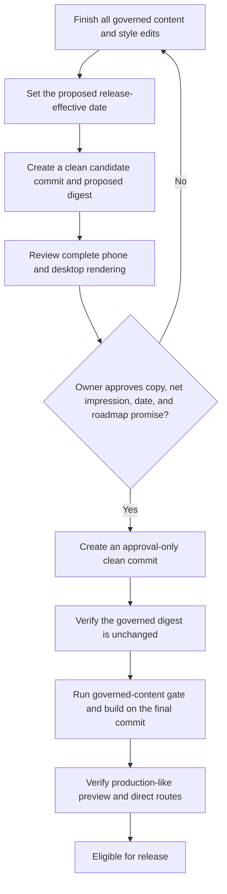

# Water Check Personalization Refinement - Plan

## Goal Capsule

- **Objective:** Make the `/thewatercheck` phone hero feel lighter, strengthen the founder story, explain future personalization with care, and keep every health, privacy, inclusion, and availability claim truthful.
- **Authority:** The Product Contract in this plan governs behavior and exact copy targets. The prior launch plan remains historical context. Current source patterns govern implementation details.
- **Execution profile:** Edit the existing Water Check component, CSS module, governed legal content, tests, and release approval record. Add no form, account, analytics, storage, health input, or new dependency.
- **Stop conditions:** Do not publish until Denzel Rigaud approves the complete rendered landing and changed legal notices, the new legal effective date, and the inclusive-testing roadmap commitment. Pause if implementation would introduce a current personalization claim, universal cycle-hydration target, ethnicity-based profile, unsupported medical benefit, or unreviewed sensitive-data promise.
- **Tail ownership:** Completion requires semantic tests, static checks, a passing governed-content release gate after approval, a production build, and browser review at phone and desktop widths.

---

## Product Contract

### Summary

Make the hero Instagram link compact on phones, remove only the hero's “Coming Soon” pill, and replace the founder-story opening with a compassionate narrative. Add a future-facing personalization section that serves every adult, offers optional menstrual-cycle context, and describes inclusive testing without ethnicity-based profiling.

### Problem Frame

At 390 pixels, the hero Instagram link stretches across nearly the full content width even though it is a secondary action. The “Coming Soon” pill repeats availability information already communicated throughout the page.

The founder story currently opens with a household census and a quoted body judgment. That framing does not carry the reader cleanly from compassion to the product principle. The page also lacks a concrete explanation of how a future journal could adapt to an individual while protecting choice and avoiding one-size-fits-all health claims.

The landing page and product legal pages are governed content. They must agree about future sensitive inputs, and any edit invalidates the current approval digest until the exact rendered copy receives renewed owner approval.

### Actors

- A1. **Prospective adult user:** Reads the product story, evaluates whether the future journal could fit their life, and may intentionally visit the Instagram community.
- A2. **Expected End owner:** Reviews the exact landing and legal copy, approves or rejects it, and authorizes the renewed governed-content digest before release.

### Key Decisions

- **All-adult product with optional women-specific context** `(session-settled: user-directed — chosen over women-first positioning or equal emphasis with no women-specific focus: the product should serve every adult while giving menstrual-cycle context meaningful, opt-in treatment)`. Governs R5-R7.
- **Inclusive testing without an ethnicity profile field** `(session-settled: user-directed — chosen over collecting ethnicity or omitting ethnicity from the inclusion discussion: representation belongs in product evaluation, not in hydration logic)`. Governs R8-R10.

### Requirements

#### Phone hero

- R1. At phone widths up to the existing 620-pixel breakpoint, only the hero Instagram community link becomes visually compact while retaining its full visible label, safe external-link behavior, keyboard focus, and minimum 44-pixel touch target.
- R2. The desktop hero link and the final dark community link retain their current presentation and behavior.
- R3. The hero “Coming Soon” pill, its empty wrapper, and dead styles are removed while the page's accessible name, future-tense copy, FAQ, legal pages, route metadata, and final “Coming Soon · 18+” kicker continue to state that the product is unreleased.

#### Founder story and personalization

- R4. The founder-story opening replaces the household census and quoted body label with the exact compassion-led copy in the Copy Contract.
- R5. A distinct “How will it be special to you?” section appears after the complete founder narrative and before the existing product walkthrough.
- R6. The section uses a semantic heading and list to explain planned personalization through user-chosen context, personal journal patterns, optional cycle context, user choice, and inclusive evaluation.
- R7. Menstrual-cycle information is described as optional context for users who track a cycle. The copy does not equate women with menstruation, infer cycles, set universal phase-based hydration targets, explain a symptom, or promise relief from bloating, cramps, hormonal changes, or another condition.
- R8. Inclusive evaluation covers adult age groups, cultures, skin tones, body types, and life stages. The copy does not present ethnicity or racial identity as biological proxies, hydration determinants, or future profile fields.
- R9. Every personalization statement remains future-facing. The current page continues to contain no form, questionnaire, account, scan upload, age input, cycle input, demographic prompt, or health-data submission.

#### Governed public promises

- R10. The Privacy and Consumer Health Data pages remove language that leaves open a future ethnicity or racial-identity profile field and align with the exact legal targets in the Copy Contract.
- R11. Water Check's current lack of a dedicated health or demographic intake and its operational request disclosures remain accurate. The legal copy distinguishes that product boundary from the linked general Contact email composer, warns visitors not to put sensitive context in free text there, and does not imply that the entire company website has no submission path. Any future age, life-stage, gender-related, or cycle context is optional, purpose-specific, never inferred from gender, and blocked behind a separate privacy, security, health-claims, and equity implementation plan.
- R12. Production release remains blocked until A2 approves the complete rendered landing and changed legal notices at phone and desktop widths, including the unchanged hero hook's net impression beside the new cycle and personalization copy.

#### Accessibility and responsive quality

- R13. The new heading and list preserve heading order, readable spacing, visible focus treatment, and freedom from horizontal overflow at 320 and 390 pixels.
- R14. Component and release tests reject removed copy, present-tense personalization, ethnicity-as-biology, universal cycle targets, symptom-fix claims, and any new health or demographic input.

#### Release sequencing

- R15. The governed source boundary includes Water Check landing, shell, legal, route, inventory, and presentation stylesheets so a qualifying style change invalidates approval like a text change.
- R16. Changed notices use the actual release-effective date approved by A2, and every rendered or literal Water Check legal date agrees with the shared approved fact.
- R17. Governed sources are frozen in a clean candidate commit before A2 review. Any later governed-source or formatting change requires a new digest and review. After approval, a second clean commit may change only the approval record; that final commit must prove the reviewed governed-content digest is unchanged and must pass the gate, build, production-like preview, and release without further changes.

### Copy Contract

#### Founder-story opening

Replace the current first paragraph with:

> I grew up around women I love and heard how quickly feeling different could turn into harsh judgment about their bodies. I wanted to create a gentler pause: a way to notice what changed, keep the day in context, and ask better questions before blaming your body. Bloating can have many causes, and lasting or concerning symptoms deserve a conversation with a qualified healthcare professional.

Keep the remaining founder narrative unless a small transition edit is required to avoid repetition. Any transition edit becomes governed copy and must receive the same A2 approval.

#### Personalization section

Use the heading:

> How will it be special to you?

Use this introduction:

> We are designing the future app so you can decide which context belongs in your journal. Personalization should help the record fit your life without turning a sensitive detail into a label.

Use these five commitments as semantic list items. The bold lead-ins are content, not separate headings.

1. **Context you choose.** The future app is being designed to let activity, climate, routine, and life stage sit beside your journal when you decide that context is useful.
2. **Your own patterns.** Look back at your entries instead of measuring yourself against another person's hydration target.
3. **Cycle context, if it applies to you.** Optional cycle check-ins could sit beside drink and bloating notes to help you notice possible patterns over time. They will not set universal phase targets or explain a symptom.
4. **Your choice comes first.** We plan to keep sensitive context optional and explain why it is useful before asking for it. The current Water Check page has no health or demographic fields.
5. **Inclusive evaluation.** We plan to test with adults across age groups, cultures, skin tones, body types, and life stages. Ethnicity and racial identity will not become hydration profile fields or biological shortcuts.

#### Legal consistency targets

The Privacy page's future-demographic section must state that ethnicity and racial identity are not planned hydration profile fields or biological proxies. If a future app proposes an age-range, gender-related, or life-stage field for a defined feature, the field must be optional, explain its purpose, offer “prefer not to say,” and complete privacy and equity review before launch.

The Consumer Health Data page must state that Water Check has no dedicated health or demographic intake and does not ask for age, gender, ethnicity, racial identity, menstrual-cycle information, or similar sensitive context. It must disclose that the linked general Contact experience opens an email composer capable of carrying visitor-entered free text and instruct visitors not to include health or other sensitive context there. It must preserve the separate Cloudflare operational-request disclosure. Any future age, life-stage, or cycle context must remain optional, have a defined purpose, never be inferred from gender, and receive privacy, security, health-claim, and equity review before implementation.

Both changed notices must use the actual release-effective date approved by A2. Update every shared fact and literal Water Check legal date that would otherwise disagree with that date.

### Key Flows

- F1. **Phone hero and community exit**
  - **Trigger:** A1 opens `/thewatercheck` at a phone width.
  - **Actors:** A1
  - **Steps:** The hero renders without its status pill, presents a compact Instagram link, and preserves the existing external navigation contract.
  - **Outcome:** The secondary CTA takes less visual space without becoming harder to read or activate.
  - **Covered by:** R1-R3, R13
- F2. **Founder story to personal relevance**
  - **Trigger:** A1 reads past the hero.
  - **Actors:** A1
  - **Steps:** The compassionate founder narrative leads into the personalization heading, introduction, and commitments before the product walkthrough.
  - **Outcome:** A1 understands how the planned product may fit an individual without reading a present-tense or medical promise.
  - **Covered by:** R4-R9, R13-R14
- F3. **Governed-copy approval**
  - **Trigger:** The landing or legal copy changes.
  - **Actors:** A2
  - **Steps:** Local tests and browser review run with a stale digest, A2 reviews the exact rendered copy, and the approval record is renewed only after approval.
  - **Outcome:** The public-content gate proves that released copy matches the approved sources.
  - **Covered by:** R10-R12, R14-R17

### Acceptance Examples

- AE1. **Compact phone community link**
  - **Covers:** F1, R1-R3, R13
  - **Given:** A1 views the hero at 390 pixels.
  - **When:** The page renders.
  - **Then:** The hero link is narrower than the content column, remains at least 44 pixels tall, shows its full label, and creates no horizontal overflow; the final community link retains its existing style.
- AE2. **Personalization without data collection**
  - **Covers:** F2, R4-R9, R13-R14
  - **Given:** A1 reads the founder section.
  - **When:** A1 reaches “How will it be special to you?”
  - **Then:** A semantic list describes future, user-chosen personalization and the page contains no form or sensitive-data input.
- AE3. **Safe cycle context**
  - **Covers:** F2, R6-R9, R14
  - **Given:** A1 reads the cycle commitment.
  - **When:** The copy describes optional cycle check-ins.
  - **Then:** It frames them as personal journal context and makes no universal hydration, symptom-cause, diagnosis, treatment, or relief claim.
- AE4. **No ethnicity profile promise**
  - **Covers:** R8-R11, R14
  - **Given:** A1 reads the landing, Privacy, and Consumer Health Data pages.
  - **When:** Inclusion and future sensitive context are described.
  - **Then:** Inclusive evaluation is future-facing, and ethnicity or racial identity is never offered as a profile field, biological proxy, or hydration determinant.
- AE5. **Release approval catches governed-content drift**
  - **Covers:** F3, R12, R14-R17
  - **Given:** A governed landing, legal, metadata, inventory, or presentation source differs from the approved digest.
  - **When:** The production content gate runs.
  - **Then:** Release fails until A2 approves the complete rendered sequence and effective date, the final approval-bearing commit contains the same reviewed governed-content digest, and that final clean commit passes the preview gate.

### Scope Boundaries

#### Included

- The hero Instagram link's phone-only sizing, hero-pill removal, and dead-style cleanup.
- The founder opening, personalization section, related legal consistency copy, semantic tests, release approval evidence, and responsive browser verification.

#### Deferred to Follow-Up Work

- Product accounts, questionnaires, cycle tracking, age or life-stage inputs, consent flows, privacy controls, data storage, AI personalization, or app logic.
- A separate future privacy and security implementation plan before any cycle or health information is collected.
- Qualitative editorial testing with target adults across ages and body sizes. This is recommended before production publication but does not add participants or research tooling to this code change.

#### Outside this product change

- Rewriting the hero hook, the remaining product walkthrough, feature cards, FAQ, company pages, or overall Water Check visual system.
- Removing truthful “Coming Soon,” “future,” “planned,” or 18+ language outside the hero pill.

---

## Planning Contract

### Key Technical Decisions

- KTD1. **Scope mobile CTA styling to the hero instance.** Use an existing component context or a narrow variant so the phone rule changes only the pasted hero link. Preserve the base external-link contract, desktop styling, final dark CTA, and 44-pixel target per R1-R2.
- KTD2. **Keep the new content inside the existing Water Check feature.** Add semantic markup to the current page and CSS module instead of creating a new component or styling system. Place the block after the full founder narrative per R5-R6. Render the five commitments as a single-column editorial list at every width, within the founder story's readable measure, with bold lead-ins as scan anchors rather than a generic card grid.
- KTD3. **Treat copy as a product contract.** Implement the Copy Contract verbatim except for an owner-reviewed transition edit. Tests assert meaning and unsafe exclusions rather than duplicating every sentence, per R4-R11.
- KTD4. **Align legal copy with the no-ethnicity-profile decision.** Update only the legal sections contradicted by R8-R11. Preserve current operational-data and 18+ language while replacing the overbroad no-submission statement with the accurate Water Check intake and general Contact boundary.
- KTD5. **Bind approval to content and presentation.** Add the three Water Check CSS modules to the governed source inventory before renewing approval. The gate binds reviewed source content and rendered facts; A2's phone and desktop review remains the manual proof of net impression, per R12 and R15.
- KTD6. **Freeze governed sources, then create an approval-only release commit.** Complete all governed-file formatting, set the actual release-effective date, create a clean candidate commit, and compute its proposed digest before A2 review. After approval, create a second clean commit that changes only the approval record. Verify that the governed-content digest is unchanged, then run the gate, build, production-like preview, and release from that final commit, per R16-R17.

### High-Level Technical Design

### Implementation Constraints

- Preserve the current React, CSS Module, semantic-query, and external-link patterns.
- Preserve `.page a`'s 44-pixel minimum height and existing focus-visible behavior.
- Use the established 620-pixel phone breakpoint. Verify 320 and 390 pixels plus a width above the breakpoint.
- Do not change `docs/legal/water-check-deployment-data-inventory.md`; its digest remains valid because this plan changes no hosting or data-processing behavior.
- Do not add deletion, export, retention-period, HIPAA, diagnostic, treatment, prevention, or guaranteed-result promises.
- Treat “We plan to test with adults across…” as an actual roadmap commitment. A2 must approve that commitment before it becomes public copy.
- Confirm whether the production branch auto-deploys before merging or pushing. No public preview, production branch update, or deployment occurs before content approval.
- Keep the prior plan at `docs/plans/2026-08-08-001-feat-water-check-coming-soon-plan.md` unchanged.

### Risks and Dependencies

- **Body-image harm:** A compassion-led paragraph can still feel reductive if it implies bloating explains body distress. The exact copy separates self-judgment from diagnosis and keeps the professional-care boundary nearby.
- **Cycle-health overclaim:** Cycle context can imply a universal hydration prescription. The Copy Contract limits it to optional journal context and rejects symptom or treatment claims.
- **Present-tense capability drift:** A marketing list may read as shipped functionality. Every introduction and commitment uses future or planned language, and tests reject current-tense personalization.
- **Presentation outside approval:** CSS can hide qualifications or change reading order. The governed inventory must include all Water Check presentation modules, and A2 must review the complete phone and desktop sequence.
- **Legal date drift:** Shared facts and literal legal prose can disagree after a notice changes. U3 updates every coupled date to the actual approved release-effective date.
- **Absolute privacy wording:** “Collects nothing” would contradict operational Cloudflare request processing, and “no way to submit” would ignore the linked general Contact email composer. Copy and tests use the narrower no-dedicated-Water-Check-intake statement, warn against sending sensitive free text, and preserve the infrastructure disclosure.
- **Sensitive-cycle-data boundary:** Optional wording alone does not establish consent or safe data handling. Any future cycle implementation requires a separate plan for minimization, consent where required, purpose limitation, retention/deletion, access/withdrawal, recipients, SDKs, breach duties, and advertising or model-training reuse.
- **Release-evidence drift:** Normal tests skip the release-only approval gate. U3 must freeze the governed candidate, renew approval in a separate approval-only commit, verify the governed digest is unchanged, and run the explicit public-content check on that final clean commit.
- **Whole-page net impression:** The unchanged hero hook beside cycle and bloating language may still imply a body-composition or causal conclusion. A2 reviews the complete sequence at phone and desktop widths and stops release if the qualification does not hold together.
- **Inclusive-testing dependency:** The new sentence is a public roadmap promise. A2 must confirm it is a real commitment and that it does not imply completed testing or proven performance.
- **Approved-commit deployment:** A different governed-source snapshot or automatic production publish can bypass the reviewed artifact. Confirm the Cloudflare trigger and release only the final approval-bearing commit after verifying its governed digest still matches the reviewed candidate.
- **Mobile scope leakage:** The base phone rule currently affects both community links. U2 scopes the selector or variant to the hero and checks the final CTA separately.

### Sources and Research

- `src/water-check/water-check-page.tsx`, `src/water-check/water-check-page.module.css`, and `src/water-check/water-check-page.test.tsx` establish the current hero, founder-story, community-link, breakpoint, and semantic-test patterns.
- `src/water-check/legal/water-check-legal-content.ts`, `src/water-check/legal/water-check-legal-page.test.tsx`, `src/water-check/legal/water-check-release-content.ts`, `src/water-check/legal/water-check-release-evidence.ts`, and `src/company-site/public-content.test.ts` establish the governed-copy approval boundary.
- `docs/plans/2026-08-08-001-feat-water-check-coming-soon-plan.md` owns the original no-collection, health-claim, 18+, and release-gate constraints.
- [FTC mobile health app guidance](https://www.ftc.gov/business-guidance/resources/mobile-health-app-developers-ftc-best-practices) supports data minimization and affirmative consent before sensitive health collection.
- [FTC Flo order](https://www.ftc.gov/news-events/news/press-releases/2021/06/ftc-finalizes-order-flo-health-fertility-tracking-app-shared-sensitive-health-data-facebook-google) and the [2024 Health Breach Notification Rule update](https://www.ftc.gov/news-events/news/press-releases/2024/04/ftc-finalizes-changes-health-breach-notification-rule) support treating cycle information as sensitive health data.
- [ACOG premenstrual syndrome guidance](https://www.acog.org/womens-health/faqs/premenstrual-syndrome) supports mentioning variable symptoms without inventing a universal cycle-phase hydration target.
- [FDA general wellness guidance](https://www.fda.gov/regulatory-information/search-fda-guidance-documents/general-wellness-policy-low-risk-devices) and [FTC health-products guidance](https://www.ftc.gov/business-guidance/resources/health-products-compliance-guidance) support keeping claims educational and ensuring the page's overall impression matches its limitations.
- [AMA policy on race as a proxy](https://policysearch.ama-assn.org/policyfinder/detail/racism?uri=%2FAMADoc%2FHOD.xml-H-65.953.xml) supports separating inclusive evaluation from ethnicity-as-biology logic.

---

## Implementation Units

### U1. Rewrite the founder story and add personalization commitments

- **Goal:** Replace the weak founder opening and add the exact future-facing personalization section without introducing a current capability or sensitive-data input.
- **Requirements:** R4-R9, R12-R14; KTD2-KTD3, KTD5
- **Dependencies:** None
- **Files:**
  - Modify `src/water-check/water-check-page.tsx`
  - Modify `src/water-check/water-check-page.module.css`
  - Modify `src/water-check/water-check-page.test.tsx`
- **Approach:**
  1. Replace the first founder paragraph with the Copy Contract and preserve the professional-care boundary.
  2. Add a sibling editorial block after the founder narrative and before the walkthrough using an `h2`, introduction, and semantic list.
  3. Style the commitments as a single-column editorial list within the founder story's readable measure at every width. Follow the existing type scale, spacing, muted palette, and 900/620/390 responsive behavior; do not turn the items into feature cards.
  4. Update semantic tests for the new structure, planned language, optional cycle context, inclusion boundary, and prohibited claims.
- **Patterns to follow:** The existing `founderStoryBody` hierarchy and React Testing Library role queries in `src/water-check/water-check-page.test.tsx`.
- **Test scenarios:**
  - Covers AE2. The founder region contains the rewritten opening, omits the household census and quoted body label, and precedes the walkthrough.
  - Covers AE2. The new section exposes the exact level-two heading and a five-item semantic list to assistive technology.
  - The personalization section is a sibling after the full founder section and before the walkthrough in document order.
  - Covers AE3. The cycle item is optional and future-facing and contains no phase target, diagnosis, symptom explanation, treatment, or relief claim.
  - Covers AE4. The inclusion item names adult evaluation groups and rejects ethnicity or racial identity as profile fields or biological shortcuts.
  - The landing page still contains no `form`, `input`, `select`, `textarea`, account flow, or sensitive-data submission control.
  - Unsafe phrases such as “we understand women,” “balances hormones,” “reduces period bloating,” and present-tense personalization are absent.
- **Verification:** The story flows from founder motivation to individual relevance, remains non-medical, and is understandable through heading and list semantics without styling.

### U2. Compact the phone hero CTA and remove the redundant status pill

- **Goal:** Reduce the hero Instagram link's phone footprint and remove the hero-only status pill without changing the final CTA or truthful availability language.
- **Requirements:** R1-R3, R13-R14; KTD1
- **Dependencies:** U1
- **Files:**
  - Modify `src/water-check/water-check-page.tsx`
  - Modify `src/water-check/water-check-page.module.css`
  - Modify `src/water-check/water-check-page.test.tsx`
- **Execution note:** This unit is responsive styling and markup cleanup. Prefer focused runtime smoke verification over CSS assertions in jsdom.
- **Approach:**
  1. Remove the hero status wrapper and pill from markup and delete their unused style selectors.
  2. Replace the broad phone full-width rule with a hero-scoped compact rule or explicit hero variant.
  3. Reduce phone padding, gap, logo size, and type size only as far as the full label and 44-pixel target remain readable at 320 pixels.
  4. Preserve the desktop hero CTA, the final compact CTA, destination, accessible name, safe external attributes, and visible focus behavior.
- **Patterns to follow:** Existing `CommunityLink` variant handling and the page's 620/390-pixel media queries.
- **Test scenarios:**
  - Covers AE1. At 390 pixels, the hero link fits its content rather than the full column, remains at least 44 pixels high, and shows the complete visible label.
  - At 320 pixels, the label wraps or fits without clipping, overlap, or horizontal page overflow.
  - Above the phone breakpoint, the hero link matches the current desktop presentation.
  - The final dark community link keeps its current centered compact treatment on phone and desktop widths.
  - The hero contains no “Coming Soon” pill while the final kicker, future wording, FAQ, legal copy, and accessible product status remain present.
  - Both Instagram links retain their destination, new-tab behavior, accessible name, logo, and `noopener noreferrer` relationship.
- **Verification:** Browser inspection shows a smaller secondary hero CTA, unchanged primary product composition, no console errors, no overflow, and no regression to the final CTA.

### U3. Align legal promises and renew governed-copy approval

- **Goal:** Make product legal copy agree with the confirmed no-ethnicity-profile decision and restore the content-bound release gate after exact-copy approval.
- **Requirements:** R8-R12, R14-R17; KTD4-KTD6
- **Dependencies:** U1, U2
- **Files:**
  - Modify `src/water-check/legal/water-check-legal-content.ts`
  - Modify `src/water-check/legal/water-check-legal-page.test.tsx`
  - Modify `src/water-check/legal/water-check-release-content.ts`
  - Modify `src/company-site/public-content.test.ts`
  - Verify `src/water-check/water-check-page.module.css`
  - Verify `src/water-check/water-check-shell.module.css`
  - Verify `src/water-check/legal/water-check-legal-page.module.css`
- **Execution note:** Let the governed-content check fail with the stale digest until A2 has reviewed the complete rendered landing and changed legal notices. Never update the digest to silence the test before approval.
- **Approach:**
  1. Replace the future-demographic and overbroad no-submission passages with the Legal Consistency Targets. Preserve operational-delivery facts, distinguish Water Check from the general Contact email composer, and add the sensitive-free-text warning.
  2. Update the shared legal fact and every coupled literal date to the actual release-effective date approved by A2.
  3. Add Water Check page, shell, and legal presentation stylesheets to the governed source inventory and cover stylesheet drift in release validation.
  4. Update legal tests to assert no ethnicity profile, no gender-to-cycle inference, no absolute “collects nothing” claim, and optional purpose-specific future sensitive context.
  5. Finish formatting, create a clean candidate commit, compute its proposed governed-content digest, and present the complete phone and desktop render plus changed legal notices to A2.
  6. After approval, create a second clean commit that changes only the approval record's approver date, effective date, and governed digest without changing the deployment-inventory approval. Verify the governed digest still matches the reviewed candidate, then run the gate and build from that final commit.
  7. Deploy the built `dist` directory to the non-production preview with `npx wrangler@4.120.0 pages deploy dist --project-name=expectedend-co --branch=water-check-preview`. Record the preview URL and final commit SHA, directly load and refresh the landing, Privacy, and Consumer Health Data routes, and keep `npm run deploy` prohibited until production deployment is separately authorized.
- **Patterns to follow:** Existing structured legal content and release validation in the Water Check legal module and public-content test.
- **Test scenarios:**
  - Covers AE4. Privacy and Consumer Health Data pages accurately distinguish the lack of a dedicated Water Check intake from the general Contact email composer and reject ethnicity or racial identity as planned hydration profile fields.
  - Future age, life-stage, gender-related, and cycle context is optional, purpose-specific, and subject to the stated reviews.
  - Privacy and Consumer Health Data describe no dedicated Water Check intake, disclose the general Contact email composer, warn against sensitive free text, and retain the Cloudflare operational-request disclosure.
  - Gender is never described as a proxy for menstrual-cycle status.
  - Every rendered and literal Water Check legal date agrees with the owner-approved release-effective date.
  - Covers AE5. A stale governed text or stylesheet digest fails the release gate with a content-mismatch error.
  - Covers AE5. The owner-approved digest passes only when it matches the reviewed landing, legal, metadata, inventory, and presentation sources, while the final commit differs from the candidate only in the approval record.
  - The deployment-inventory digest and operational-data description remain unchanged because hosting and data behavior did not change.
- **Verification:** The legal surfaces agree with the landing promise, A2 has approved the whole rendered sequence and effective date, and the final approval-only commit preserves the reviewed governed digest while passing the release-only gate, build, and production-like preview.

---

## Verification Contract

| Gate | Applies to | Done signal |
|---|---|---|
| `npm test -- --run src/water-check/water-check-page.test.tsx src/water-check/legal/water-check-legal-page.test.tsx` | U1-U3 | Focused semantic and legal tests pass. |
| `npm test -- --run` | U1-U3 | The full Vitest suite passes without company-site or route regressions. |
| `npm run check` | U1-U3 | TypeScript and Biome report no errors. |
| `npm run build` | U1-U3 | The production Vite build completes. |
| `npm run check:public-content` | U3 | After whole-page approval and digest renewal, the governed text and stylesheet release gate passes. |
| Browser review at 320, 390, above 620, and desktop widths | U1-U3 | Hero CTA scope, 44-pixel target, final CTA, story hierarchy, wrapping, focus, and overflow match R1-R9 and R13; A2 also reviews the changed Privacy and Consumer Health Data notices at phone and desktop widths. |
| Content review against the Copy Contract | U1-U3 | No present-tense personalization, ethnicity-as-biology, universal cycle target, medical benefit, or unsupported privacy promise appears in the net impression. |
| `npx wrangler@4.120.0 pages deploy dist --project-name=expectedend-co --branch=water-check-preview` from the final approval-bearing commit | U3 | The recorded preview URL and commit SHA directly load and refresh the landing, Privacy, and Consumer Health Data routes with the approved copy, date, styles, and no new network, cookie, or browser-storage behavior. |

---

## Definition of Done

- U1 is complete when the founder opening and personalization section match the Copy Contract, semantic tests cover the new structure, and no sensitive-data control exists.
- U2 is complete when only the phone hero community link becomes smaller, the hero pill and dead styles are gone, other availability language remains, and browser review proves no CTA or overflow regression.
- U3 is complete when the legal surfaces agree with the no-ethnicity-profile and Contact-boundary decisions, every legal date matches the approved release-effective date, governed stylesheets participate in the digest, A2 has approved the clean candidate snapshot, and the final approval-only commit proves that digest unchanged before passing the release gate, build, and production-like preview.
- All Verification Contract gates pass in their required order.
- The final diff contains no abandoned selectors, duplicate copy blocks, experimental components, unrelated page rewrites, or generated artifacts from failed approaches.
