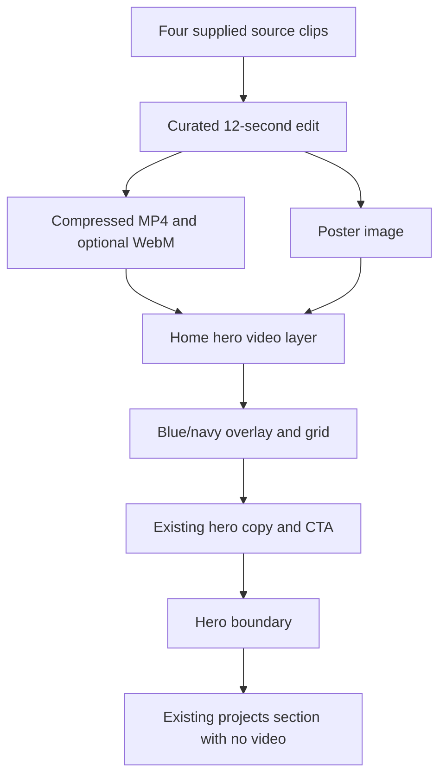

# feat: Add an optimized hero video montage

## Goal Capsule

- **Objective:** Visitors see a distinctive, polished Expected End introduction without slowing the homepage or obscuring its message.
- **Means:** Replace the static hero atmosphere with a short, silent, optimized video montage beneath the existing blue-and-gold presentation. (KTD3, KTD4)
- **Authority:** Preserve the user-approved homepage copy, navigation, project section, and visual identity. The hero video is decorative.
- **Stop conditions:** The montage stays inside the home hero, remains readable under the blue treatment, falls back cleanly when motion is reduced or video cannot play, and does not use the full-size source clips directly.
- **Execution profile:** Media preparation first, then homepage integration and automated/static verification, followed by desktop and mobile localhost review.

---

## Product Contract

### Summary

Add a fast looping video montage behind the homepage hero content. Keep the recognizable blue layer in front of the footage, but make it translucent enough for the people-and-work scenes to add depth.

### Problem Frame

The current home hero has a strong static blue grid treatment but does not show the motion and creative energy in the supplied footage. The four source clips are 4K and together exceed 200 MB, so using them as-is would make the opening page needlessly heavy.

### Requirements

- R1. The home hero displays one short silent montage assembled from all four user-supplied clips, with approximately three seconds of selected footage from each clip and a seamless loop.
- R2. The video is limited to the initial home hero. It ends visually at the hero boundary before the projects and app content begins.
- R3. The existing blue identity remains above the footage through a layered navy/blue wash, subtle grid, and the current white-and-gold copy; the overlay must allow the footage to remain visibly present rather than becoming a solid blue screen.
- R4. The montage is delivered as web-optimized media with a poster fallback, not as the original 4K source files.
- R5. The hero remains readable, usable, and stable on desktop and mobile. Visitors who prefer reduced motion receive the poster/static visual instead of moving footage.

### Key Decisions

- KTD1. **Short four-clip montage** (session-settled: user-approved — chosen over running the full source videos: the user requested one video that is not too long). Governs R1, R4.
- KTD2. **Blue stays in front of the video** (session-settled: user-directed — chosen over removing the blue treatment: the user wants blue in front, but not at maximum opacity). Governs R3.

### Success Criteria

- The home hero shows a calm, looping motion background that is visibly blue-branded and leaves every current hero text and action legible.
- The next section returns to the existing opaque site background with no video bleed, layout jump, or scroll obstruction.
- The media payload is dramatically smaller than the original 209 MB input set and does not contain an audio track.

### Scope Boundaries

- In scope: the homepage hero, the hero video assets, a static poster, motion accessibility, and local responsive QA.
- Out of scope: video backgrounds on About, projects, service pages, dialogs, and Water Check.
- Out of scope: a video player UI, sound, user playback controls, analytics, streaming infrastructure, and changing the existing hero copy or navigation.

---

## Planning Contract

### Key Technical Decisions

- KTD3. **Use a 12-second silent montage encoded for the web.** Select a strong, non-identifying three-second segment from each supplied clip, use clean cuts or very short dissolves, crop to a shared 16:9 composition, remove audio, and export a compressed MP4 plus a smaller WebM source when the visual quality holds. Keep the MP4 at 5 MB or less, the WebM at 4 MB or less, and the poster at 250 KB or less; lower resolution or bitrate when an export exceeds its budget. Supports R1, R4.
- KTD4. **Layer the video locally inside the hero.** Put the video at the base of `HomePage`'s hero and keep the existing content above it. Use a dedicated overlay layer that combines a dark navy gradient, a moderate blue wash, and the existing subtle grid treatment. The overlay should vary in density across the hero so the center copy remains high contrast while the footage remains visible at the edges. Supports R2, R3, R5.
- KTD5. **Treat motion as decorative.** Render a poster image immediately, use muted inline autoplay and loop only for users without reduced-motion preferences, and hide or pause the moving layer under `prefers-reduced-motion`. Mark the video as decorative for assistive technology. No sound or playback controls are introduced. Supports R4, R5.
- KTD6. **Keep the video out of layout and scroll mechanics.** Use absolute positioning and clipping in the hero so the section keeps its established viewport height and the following projects section remains independent. Supports R2, R5.

### High-Level Technical Design

### Sequencing

U1 produces the only deployable media inputs. U2 adds the semantic and visual hero layers using those inputs. U3 protects the reduced-motion and responsive paths, then verifies the result in the local app.

### Risks & Dependencies

- **Source use:** Confirm Expected End can use the supplied clips before deployment. Keep the originals outside the repository and commit only the optimized exports.
- **Contrast:** Bright office scenes can reduce copy contrast. Tune the overlay and poster from actual rendered screenshots, not only from the raw footage.
- **Autoplay:** Browser policies vary. The static poster is an intentional first-class fallback, not an error state.
- **Payload:** Large media can hurt first-load experience. Enforce the KTD3 export budgets before merge; if an export exceeds them, reduce resolution or bitrate before changing page behavior.

### Sources / Research

- `src/company-site/home.tsx` and `src/company-site/style.module.css` establish the existing hero boundary, stacking context, typography, fixed navigation, and mobile hero height.
- The supplied source clips are 25 fps, 16:9 H.264 footage. Together they are approximately 209 MB and about 115 seconds long, which confirms the need for a curated, compressed export.
- The supplied footage shows varied office and team scenes, suitable for a calm creative-work montage rather than rapid cuts.
- [Corpay's homepage](https://www.corpay.com/) was used as the user's reference for a contained motion-led entry experience, not as a design copy target.
- [MDN's video performance guidance](https://developer.mozilla.org/en-US/docs/Learn_web_development/Extensions/Performance/video) supports removing audio from muted hero video and serving compressed formats; [MDN's autoplay guide](https://developer.mozilla.org/en-US/docs/Web/Media/Guides/Autoplay) supports muted inline playback; [MDN's reduced-motion reference](https://developer.mozilla.org/en-US/docs/Web/CSS/Reference/At-rules/%40media/prefers-reduced-motion) supports honoring the operating-system motion preference.

---

## Implementation Units

### U1. Produce web-ready hero assets

- **Goal:** Turn the four supplied clips into a short, silent, brand-ready montage and a poster image.
- **Requirements:** R1, R4.
- **Dependencies:** None.
- **Files:** `public/media/expected-end-hero.mp4`, `public/media/expected-end-hero.webm`, `public/media/expected-end-hero-poster.webp`.
- **Approach:** Select approximately three seconds from each clip, normalize the framing and color enough for a coherent loop, remove audio, and export MP4 plus WebM only when its size benefit is worthwhile. Derive the poster from a clear frame that retains space for the centered hero copy.
- **Execution note:** Prefer a visual export-and-review loop. Check the asset’s dimensions, duration, audio-stream absence, and file size before integration.
- **Test expectation:** none — this is a media-preparation unit. Its proof is media inspection plus the browser integration checks in U3.
- **Verification:** The exports are silent, loop cleanly, retain acceptable visual quality, and are a small web payload compared with the source clips.

### U2. Add the contained hero video presentation

- **Goal:** Render the optimized montage behind the current homepage hero without changing the hero’s text, action, or downstream sections.
- **Requirements:** R2, R3, R4.
- **Dependencies:** U1.
- **Files:** `src/company-site/home.tsx`, `src/company-site/style.module.css`, `src/company-site/home.test.tsx`.
- **Approach:** Add a decorative, assistive-technology-hidden video element and poster within the existing hero, then place an overlay/grid treatment between it and the existing hero content. Preserve the current hero isolation, fixed navigation stacking, viewport sizing, and project-section boundary. Use no controls and no audio.
- **Patterns to follow:** Existing hero markup and CSS custom properties in `src/company-site/home.tsx` and `src/company-site/style.module.css`; existing component tests in `src/company-site/*.test.tsx`.
- **Test scenarios:**
  - Rendering the home page includes the decorative hero video with a poster and the intended MP4/WebM sources.
  - The video is configured as muted, looping, inline decorative media and does not expose playback controls.
  - The video has no accessible name or focus behavior that competes with the hero heading and CTA.
  - The current hero heading, mission statement, and projects action remain present and usable.
- **Verification:** The homepage renders the new media layer without changing the structure or destination of the current hero action.

### U3. Protect motion preferences and validate the hero in context

- **Goal:** Make the new hero feel fast and readable across the supported viewport and motion-preference paths.
- **Requirements:** R2, R3, R5.
- **Dependencies:** U1, U2.
- **Files:** `src/company-site/style.module.css`, `src/company-site/home.test.tsx`.
- **Approach:** Add a reduced-motion rule that suppresses the moving video while preserving the poster and blue overlay. Tune object positioning, overlay opacity, and the hero clipping from rendered desktop and narrow-phone views. Confirm the video layer cannot extend into the projects section.
- **Execution note:** Use localhost screenshots and a mobile-sized browser viewport as the primary proof for this style-led unit.
- **Test scenarios:**
  - With reduced motion enabled, the static hero presentation remains visible while the moving video is not displayed.
  - On a narrow viewport, the navigation, title, statement, and CTA remain readable above the background.
  - Scrolling from the hero to projects reveals the existing opaque project background with no video visible below the hero boundary.
  - If the video cannot load, the poster and existing blue treatment still produce a complete hero.
- **Verification:** Desktop and mobile localhost review show no overlap, clipping issue, unreadable copy, or video bleed.

---

## Verification Contract

| Scope | Command or check | Done signal |
|---|---|---|
| Component behavior | `npm test -- src/company-site/home.test.tsx` | The video semantics, fallback, and unchanged hero content are covered. |
| Type and style quality | `npm run check` | TypeScript and Biome pass. |
| Production build | `npm run build` | The site builds with the media assets included. |
| Media inspection | Inspect exported streams and file sizes | The montage is silent, short, web-sized, and has a usable poster. |
| Browser QA | Run the local Vite site at desktop and phone widths, including reduced motion | The video is contained to the hero and copy remains readable. |

---

## Definition of Done

- U1-U3 are complete and their verification signals pass.
- The homepage hero contains a short silent montage from all four supplied clips, with an immediate poster fallback.
- The blue/gold Expected End identity remains legible over the footage and is visibly less opaque than the current solid background.
- The video is not present outside the hero and does not alter the project/app content below it.
- Reduced-motion users receive a static, complete hero.
- The final media is optimized for the web and no experimental or unused exports remain in the repository.
