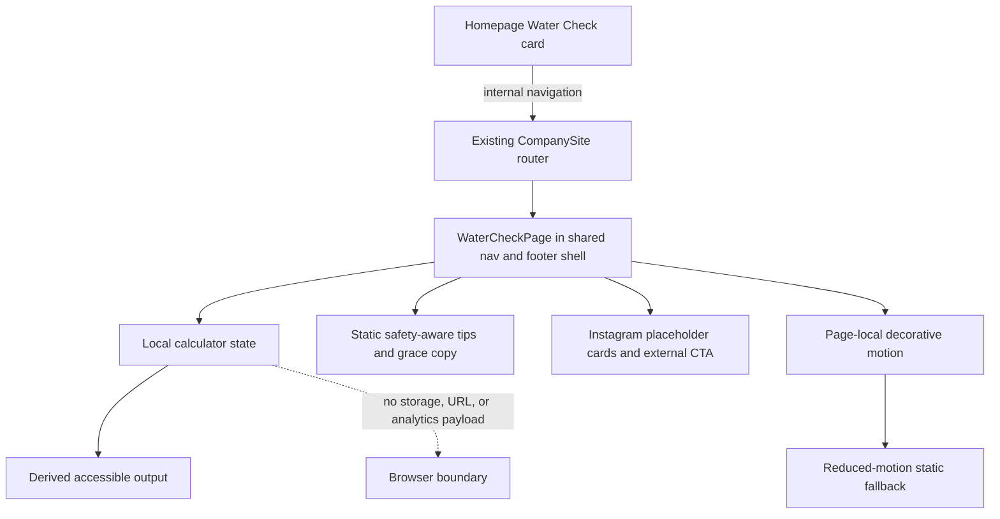

# Water Check Utility Page - Plan

## Goal Capsule

- **Objective:** Visitors can move from The Water Check homepage card to a focused, trustworthy hydration page, explore a private hydration estimate, learn practical habits, and reach the Instagram community.
- **Means:** Add `/thewatercheckpage` to the existing client-side site, build the page with prefixed Tailwind utilities and an isolated water-ripple animation, and update the homepage project cards and public metadata (KTD1-KTD6).
- **Authority:** The confirmed scope and safety-aware product decisions in this plan govern implementation. Existing repository conventions govern details not specified here.
- **Execution profile:** Code change with owner-reviewed public content. The page is not a medical tool and does not collect hydration inputs.
- **Stop conditions:** Do not deploy while `PUBLIC_CONTENT_APPROVED` is false. Stop for owner review if copy changes reintroduce categorical medical claims or if analytics begins receiving weight, activity, or calculated-result values.
- **Tail ownership:** The implementer owns route, page, homepage, metadata, and automated coverage. The owner retains final public-copy approval and the later decision to replace Instagram placeholders with embeds.

---

## Product Contract

### Summary

Add a minimalist Water Check utility page at `/thewatercheckpage`. The page combines a hydration starting-point calculator, compassionate copy, practical hydration tips, restrained motion, and a direct Instagram community link. The Water Check artwork on the homepage becomes circular and links internally to the new page. Both homepage store cards receive a consistent “Coming soon” status.

### Problem Frame

The homepage currently sends The Water Check visitors directly to Instagram, so Expected End cannot provide the requested utility experience first. The existing Water Check Store has a strong liquid animation, but reusing its full-screen fill sequence would make the new page feel like a store intro instead of a calm tool. The requested calculator and body-related copy also make health accuracy and privacy part of the product experience: an arithmetic estimate must not be presented as an exact medical requirement, and user-entered values must not become analytics data.

### Key Decisions

- KD1. **Create a fresh plan instead of rewriting either retired Water Check plan (session-settled: user-directed — chosen over rewriting an old plan: preserve the history of the previous concepts).** Governs R1-R14.
- KD2. **Use the safety-aware version of the supplied health content (session-settled: user-approved — chosen over publishing the original claims verbatim: retain the emotional intent without presenting categorical medical explanations).** Governs R4-R8.
- KD3. **Use a distinct ripple-and-refraction motion language (session-settled: user-approved — chosen over reusing the store intro: keep the utility experience calm and distinct).** Governs R3, R11.
- KD4. **Ship Instagram placeholders (session-settled: user-approved — chosen over live Reel embeds: defer third-party loading behavior until a later owner decision).** Governs R10, R14.

### Requirements

**Navigation and presentation**

- R1. The public router must resolve `/thewatercheckpage` as a first-class page with route-specific title, description, canonical URL, and normal Expected End navigation and footer.
- R2. The Water Check homepage artwork must render as a circle and its artwork link and primary action must navigate internally to `/thewatercheckpage`; the Bio interaction must remain available.
- R3. The new page must use a dark, minimalist, mobile-first layout with the headline “Ditch the influencers. Learn your actual baseline.” and the supporting line “No sign-ups. Just a practical starting point for your daily hydration.”

**Calculator and health framing**

- R4. The calculator must expose native range controls for weight from 80 to 300 pounds and daily activity from 0 to 120 minutes, with current values, units, visible labels, and keyboard support.
- R5. The page must calculate `(weight / 2) + ((activity / 30) * 12)` in React state and update the displayed “Your Daily Goal: X Ounces” result immediately; preserve a `.5` result and otherwise show a whole number.
- R6. The result must be accompanied by the adjacent adult-estimate guidance in the Product Copy Contract.
- R7. Weight, activity, and result values must remain ephemeral in component memory. They must not be stored, added to URLs, submitted, or attached to analytics events.
- R8. The grace section must use the heading and review draft in the Product Copy Contract.

**Utility, community, and homepage status**

- R9. A responsive utility grid must present the three safety-aware tips in the Product Copy Contract.
- R10. The community section must be titled “Join the actual community.”, include three non-interactive Reel placeholder cards labeled “Instagram Reel coming soon”, stack those cards on mobile, and provide a prominent external link to `https://www.instagram.com/thewatercheck/` labeled for `@thewatercheck`.
- R11. The page must use a gentle concentric-ripple and refracted-light animation that does not block interaction, does not imitate `/thewatercheckstore`'s liquid-fill intro, and becomes static when reduced motion is requested.
- R12. Both homepage store cards must display the same explicit “Store · Coming soon” category text while their internal store links continue to work.
- R13. The page must remain usable at narrow mobile widths and at 200% browser zoom, with one-column stacking, visible focus states, sufficient contrast, and decorative motion hidden from assistive technology.
- R14. No Instagram iframe, Meta embed script, account system, saved calculator history, backend, personalization service, or custom health analytics event is part of this release.

### Product Copy Contract

- **Adult-estimate guidance (R6):** “This calculator gives a general estimate for adults, not a medical prescription. Needs vary with health, climate, pregnancy, diet, medicines, and exercise. Do not force fluids. Ask a healthcare professional about your needs if you have a kidney or heart condition, a fluid restriction, or concerning symptoms.”
- **Grace heading (R8):** “A Quick Note on Giving Yourself Grace”
- **Grace body review draft (R8):** “We spend so much time stressing over the mirror or feeling frustrated when our clothes fit differently than they did two days ago. Bodies change day to day for many reasons, and hydration can be one part of that picture. You do not need to punish yourself for a normal fluctuation. Drink water regularly, listen to thirst, and let care—not shame—set the pace. Persistent bloating, swelling, rapid weight changes, or symptoms that worry you deserve a conversation with a healthcare professional.”
- **The Schedule (R9):** “Start your morning with water, sip with meals, and let thirst, weather, and activity guide the rest.”
- **Electrolytes (R9):** “Most people replace electrolytes through regular meals. After long or heavy sweating, choose a balanced electrolyte drink; do not add salt routinely if you have been advised to limit sodium.”
- **The Visual Check (R9):** “Pale yellow urine can be one rough sign of hydration. Food, vitamins, medicines, and health conditions can change color, so it is not a diagnosis.”

### Key Flows

- F1. **Homepage entry**
  - **Trigger:** A visitor activates The Water Check artwork or its primary action.
  - **Steps:** The existing internal-link handler updates browser history, resolves `/thewatercheckpage`, scrolls to the top, and refreshes document metadata.
  - **Outcome:** The visitor sees the Water Check hero within the standard Expected End shell.
  - **Covered by:** R1-R3.
- F2. **Hydration estimate**
  - **Trigger:** A visitor changes either range input with pointer or keyboard.
  - **Steps:** Local React state changes, the formula recomputes, and the associated result updates without navigation or network activity.
  - **Outcome:** The visitor sees a readable estimate and its safety context.
  - **Covered by:** R4-R7.
- F3. **Community exit**
  - **Trigger:** A visitor activates the Instagram call to action.
  - **Steps:** The browser opens the official `@thewatercheck` profile as an external destination with safe link attributes.
  - **Outcome:** No Meta embed or tracking script is loaded by the Water Check page itself.
  - **Covered by:** R10, R14.

### Acceptance Examples

- AE1. **Covers R2.** Given the homepage, when a visitor activates the circular Water Check artwork, then the URL becomes `/thewatercheckpage`, the page heading appears, and no new tab opens.
- AE2. **Covers R4-R6.** Given weight 160 and activity 30, when those values are selected, then the result reads “Your Daily Goal: 92 Ounces” and the estimate disclaimer remains visible.
- AE3. **Covers R4-R6.** Given weight 81 and activity 0, when those values are selected, then the result preserves the half-ounce output as “40.5 Ounces.”
- AE4. **Covers R7.** Given changed slider values, when the visitor refreshes or leaves and returns, then defaults are restored and the URL contains no health values.
- AE5. **Covers R11, R13.** Given `prefers-reduced-motion: reduce`, when the page loads, then decorative ripple and refraction layers are static while the calculator remains fully interactive.
- AE6. **Covers R12.** Given the homepage, both store projects display “Store · Coming soon” and both “Enter store” links still reach their existing routes.

### Success Criteria

- The new page communicates utility and empathy without claiming that one formula is exact for every body.
- A visitor can complete the main flow on mobile, by keyboard, and with reduced motion without encountering a focus, layout, or navigation trap.
- No health input or estimate crosses the browser boundary.
- The repository's owner-approval gate prevents publication before the final copy review.

### Scope Boundaries

**In scope**

- The new page, route integration, public metadata, sitemap, homepage circle treatment, internal link, consistent store status copy, and focused automated/browser verification.

**Deferred to follow-up work**

- Live Instagram Reel embeds and any consent or loading strategy they require.
- A site-wide analytics consent-management project; this page only guarantees that calculator values are never sent as custom analytics data.
- Saved goals, unit switching, weather-aware guidance, personalized medical logic, accounts, and backends.

**Outside this product's identity**

- Diagnosis, treatment advice, weight-loss promises, fluid prescriptions, and explanations that attribute body size or symptoms to a single cause.

### Sources

- Existing routing and metadata pattern: `src/company-site/routes.ts` and `src/company-site/index.tsx`.
- Existing homepage card pattern: `src/company-site/home.tsx`, `src/company-site/content.ts`, and `src/company-site/style.module.css`.
- Existing Water Check Store motion and reduced-motion behavior: `src/company-site/storefront.tsx` and `src/company-site/storefront.module.css`.
- Historical safeguards and content-governance context: `docs/plans/2026-08-08-001-feat-water-check-coming-soon-plan.md` and `docs/plans/2026-08-09-001-feat-water-check-personalization-refinement-plan.md`.
- [Tailwind CSS installation with Vite](https://tailwindcss.com/docs/installation/using-vite) and [disabling Preflight](https://tailwindcss.com/docs/preflight).
- [NIH: Hydrating for Health](https://newsinhealth.nih.gov/2023/05/hydrating-health), which states that needs vary with factors including age, location, body weight, activity, illness, and medicines.
- [National Academies: Dietary Reference Intakes for Water](https://www.nationalacademies.org/read/10925/chapter/6), which states that there is no single daily requirement for every person and that needs vary markedly.
- [NIDDK: Healthy Eating for Adults with Chronic Kidney Disease](https://www.niddk.nih.gov/health-information/kidney-disease/chronic-kidney-disease-ckd/healthy-eating-adults-chronic-kidney-disease), which notes that some people with kidney disease need fluid limits.
- [Mayo Clinic: Water—How much should you drink every day?](https://www.mayoclinic.org/healthy-lifestyle/nutrition-and-healthy-eating/in-depth/water/art-20044256), which describes individual variation and the risk of excessive water intake.

---

## Planning Contract

### Key Technical Decisions

- KTD1. **Extend the manual company router.** Add a `watercheck-page` route key and render branch instead of introducing a routing dependency. This follows the same history, popstate, hash, and metadata path as existing company pages. Governs R1, R2.
- KTD2. **Export `WaterCheckPage` from a repo-conventional lowercase file.** Create `src/company-site/water-check-page.tsx`; the component name satisfies the requested React API while the filename matches neighboring modules. Governs R1, R3-R11.
- KTD3. **Integrate Tailwind v4 through Vite without Preflight (session-settled: user-approved — chosen over a CSS-module-only implementation: honor the requested Tailwind build while protecting the existing CSS baseline).** Add `tailwindcss` and `@tailwindcss/vite`, import only prefixed theme and utility layers from a dedicated page stylesheet, and omit Preflight so this one page cannot reset the existing CSS-module site. Use the `tw:` prefix for all generated utilities. Governs R3, R9-R13.
- KTD4. **Use Lucide only for meaningful utility and external-link icons.** Add `lucide-react`, keep icons decorative with accessible text carrying meaning, and do not replace the site's unrelated existing SVG action icons. Governs R9, R10, R13.
- KTD5. **Keep calculator logic local and deterministic.** Initialize weight to 160 and activity to 30, use integer slider steps of 1 minute/pound, derive rather than store the result, and format only `.5` fractional results. Do not persist or instrument these values. Governs R4-R7.
- KTD6. **Implement motion as page-local CSS decoration.** Use pointer-events-none, aria-hidden ripple/refraction layers with CSS keyframes and a complete reduced-motion override. Do not reuse the storefront intro component or its animation names. Governs R11, R13.
- KTD7. **Treat public copy and discoverability as governed release content.** Update structured data and the sitemap for the new canonical page, invalidate the current public-content approval during implementation, and require an explicit owner review before restoring approval. Governs R1, R3, R6, R8-R10, R12.

### High-Level Technical Design

### Implementation Constraints

- Preserve the user's current unrelated working-tree changes, especially the in-progress Google Analytics and legal-content edits.
- Tailwind utilities must be statically discoverable class strings. Do not build class names dynamically.
- Do not add Tailwind Preflight or migrate existing CSS modules to Tailwind.
- Keep native range inputs instead of building custom slider semantics.
- The health disclaimer must remain adjacent to the result rather than being hidden in the footer or legal page.
- The standard site navigation and footer remain visible on `/thewatercheckpage`; only store routes keep their special shell exception.

### Risks and Mitigations

- **Medical overstatement:** The requested “exact” language and categorical body claims can mislead. Mitigate through KD2, adjacent estimate framing, contraindication guidance, and owner review.
- **Potentially high estimate:** The fixed formula can produce 198 ounces at the maximum inputs. Mitigate by presenting the number as arithmetic output rather than a drinking prescription and warning against forcing fluid intake.
- **Global styling regression:** Tailwind Preflight could alter the established site. Mitigate with the prefixed, no-Preflight integration in KTD3 and homepage regression checks.
- **Motion discomfort or visual noise:** Decorative water effects can compete with the calculator. Mitigate with low-opacity layers, no interaction blocking, and the reduced-motion contract in R11.
- **Public approval drift:** Existing release approval predates the new health copy. Mitigate with KTD7 and the existing `check:public-content` deploy gate.
- **Future embed privacy:** Instagram embeds can add third-party scripts and cookies. Keep them deferred under KD4 until the owner chooses an explicit loading/consent strategy.

---

## Implementation Units

### U1. Add isolated Tailwind and icon tooling

- **Goal:** Enable Tailwind utilities for the new page without changing the established site's CSS baseline.
- **Requirements:** R3, R9-R13.
- **Dependencies:** None.
- **Files:** `package.json`, `package-lock.json`, `vite.config.ts`, `src/company-site/water-check-page.css`.
- **Approach:**
  1. Add compatible pinned project dependencies for Tailwind v4, its Vite plugin, and Lucide React.
  2. Register the Tailwind Vite plugin alongside the React plugin.
  3. Create the page stylesheet with prefixed theme and utility imports only; omit Preflight per KTD3.
  4. Define page-local ripple, refraction, range-control accent, and reduced-motion rules that cannot affect unrelated routes.
- **Patterns to follow:** Existing dependency pinning in `package.json`; reduced-motion coverage in `src/company-site/style.module.css` and `src/company-site/storefront.module.css`.
- **Test scenarios:** Test expectation: none — this unit is build tooling and CSS scaffolding; compilation and browser regression evidence belongs in the Verification Contract.
- **Verification:** The app compiles with prefixed Tailwind classes, existing company pages retain their current baseline styles, and reduced-motion rules cover every new keyframe.

### U2. Build the Water Check page and calculator

- **Goal:** Deliver the complete responsive utility page and its private real-time estimate.
- **Requirements:** R3-R11, R13, R14; AE2-AE5.
- **Dependencies:** U1.
- **Files:** `src/company-site/water-check-page.tsx`, `src/company-site/water-check-page.css`, `src/company-site/water-check-page.test.tsx`.
- **Approach:**
  1. Compose semantic hero, calculator, grace note, tip grid, community placeholders, and Instagram CTA regions in `WaterCheckPage`.
  2. Implement native labeled ranges and derived result formatting per KTD5, with an associated `output` and polite live status.
  3. Place the adult-estimate and health-condition guidance directly with the calculator result.
  4. Use owner-review-ready grace and tip copy that satisfies R8 and R9 rather than the rejected categorical claims.
  5. Use Lucide icons only as aria-hidden visual reinforcement and retain complete text labels.
  6. Add decorative ripple/refraction elements per KTD6, keeping them out of the accessibility tree and interaction layer.
- **Patterns to follow:** Semantic section structure and typography composition in `src/company-site/about.tsx`; external-link safety attributes in `src/company-site/home.tsx`.
- **Test scenarios:**
  - Covers AE2. Render defaults and assert the 160-pound, 30-minute estimate is 92 ounces with the disclaimer visible.
  - Covers AE3. Change inputs to 81 pounds and 0 minutes and assert the output is 40.5 ounces.
  - Set all four slider boundaries and verify their visible values and calculated outputs.
  - Change a slider with keyboard events and verify the associated value and result update.
  - Assert every range has an accessible label and its visible unit, the output associates with both controls, icons/decorations are hidden, and the Instagram CTA has safe external-link attributes.
  - Covers AE4. Unmount and remount the page and verify defaults return with no URL mutation or storage writes.
- **Verification:** The page renders every requested section, calculator results match the formula and formatting contract, all inputs remain local, and component accessibility assertions pass.

### U3. Register the route and public discovery metadata

- **Goal:** Make `/thewatercheckpage` a navigable and discoverable Expected End page.
- **Requirements:** R1, R14; F1; AE1.
- **Dependencies:** U2.
- **Files:** `src/company-site/routes.ts`, `src/company-site/index.tsx`, `src/company-site/routes.test.ts`, `src/company-site/index.test.tsx`, `index.html`, `public/sitemap.xml`, `src/company-site/public-content.test.ts`.
- **Approach:**
  1. Add the route key, path, page-specific metadata, and render branch through the existing company shell per KTD1.
  2. Add the canonical page to the sitemap.
  3. Change The Water Check structured-data URL to the new canonical page while retaining Instagram in `sameAs`.
  4. Replace the retired-route assertion only for `/thewatercheckpage`; keep `/thewatercheck` and its retired subpaths as not-found routes.
- **Patterns to follow:** Existing store route entries and metadata tests in `src/company-site/routes.ts` and `src/company-site/routes.test.ts`; Organization ownership JSON-LD in `index.html`.
- **Test scenarios:**
  - Resolve `/thewatercheckpage` and its trailing-slash form to `watercheck-page` with the expected canonical URL.
  - Covers AE1. Navigate to the route through the internal handler and assert page heading, pathname, shared navigation/footer, title, description, canonical URL, and Open Graph URL.
  - Dispatch popstate into and away from the new route and verify route content and metadata update.
  - Assert `/thewatercheck` remains retired.
  - Assert the sitemap and JSON-LD use `https://expectedend.co/thewatercheckpage`, with Instagram retained only as the community `sameAs` destination.
- **Verification:** Direct entry, internal navigation, browser history, metadata, JSON-LD, and sitemap all agree on the exact canonical route.

### U4. Update homepage Water Check and store cards

- **Goal:** Turn the Water Check artwork into the new page entry point and make both store statuses unambiguous.
- **Requirements:** R2, R12, R13; AE1, AE6.
- **Dependencies:** U3.
- **Files:** `src/company-site/content.ts`, `src/company-site/home.tsx`, `src/company-site/style.module.css`, `src/company-site/index.test.tsx`.
- **Approach:**
  1. Change The Water Check destination and action label to the internal utility page while preserving the Bio button.
  2. Set the watercheck art variant's shared radius custom property to 50% so the existing clip, mask, image crop, hover, and focus behavior all become circular.
  3. Normalize both store categories to the R12 copy without changing their destinations or collage variants.
  4. Update homepage behavior assertions for internal navigation, circle styling hook, Bio retention, and store statuses.
- **Patterns to follow:** Existing `PROJECTS` data-driven rendering and internal/external destination branching in `src/company-site/home.tsx`.
- **Test scenarios:**
  - Covers AE1. The Water Check artwork and primary action both use `/thewatercheckpage`, are handled internally, and omit external-link attributes.
  - The Water Check Bio button still opens its dialog and restores focus after close.
  - The Water Check art keeps a square image crop inside a circular clipping surface at desktop and mobile dimensions.
  - Covers AE6. Both cards expose “Store · Coming soon” while each “Enter store” action retains its original internal route.
  - Modified clicks on the new internal links remain browser-native and do not get intercepted.
- **Verification:** Homepage navigation and text match the product contract, only the Water Check community artwork is circular, and both stores remain reachable.

### U5. Complete content approval and end-to-end quality review

- **Goal:** Prove the integrated experience and leave deployment gated on explicit owner approval.
- **Requirements:** R1-R14; AE1-AE6.
- **Dependencies:** U1-U4.
- **Files:** `src/company-site/content.ts`, `src/company-site/public-content.test.ts` and any test files already listed by U2-U4 that require final expectation alignment.
- **Approach:**
  1. Mark governed public content unapproved when implementation begins and update the approval comment to identify the new Water Check copy scope.
  2. Inspect the page at representative phone and desktop widths, at 200% zoom, with keyboard-only navigation, and with reduced motion.
  3. Inspect the homepage to ensure Tailwind integration did not alter unrelated cards, navigation, dialogs, or store routes.
  4. Present final health, grace, tip, and store-status copy to the owner; restore `PUBLIC_CONTENT_APPROVED` only after explicit approval.
- **Patterns to follow:** Existing release gate in `src/company-site/public-content.test.ts` and deploy ordering in `package.json`.
- **Test scenarios:**
  - The public-content release check fails while approval is false and passes only after owner approval is recorded.
  - No page markup, URL, storage entry, or analytics call contains weight, activity, or result data after calculator interaction.
  - All AE1-AE6 flows pass in the integrated app.
  - Existing About, legal, homepage dialog, and both store route tests remain green.
- **Verification:** Automated checks pass, visual and interaction review finds no mobile or accessibility regression, and the release approval state accurately reflects the owner's decision.

---

## Verification Contract

| Gate | Applies to | Required outcome |
|---|---|---|
| `npm run check` | U1-U5 | TypeScript and Biome checks pass with no new warnings or ignored files. |
| `npm test -- --run` | U2-U5 | All existing and new Vitest suites pass. |
| `npm run build` | U1-U5 | Tailwind Vite integration and production bundling complete successfully. |
| `npm run check:public-content` | U3-U5 | The release gate fails before owner approval and passes only after the approved flag and public assertions match final content. |
| Browser review on the existing local Vite server | U2-U5 | Homepage entry, calculator boundaries, external Instagram exit, history navigation, 320px layout, desktop layout, 200% zoom, keyboard focus, and reduced-motion behavior match R1-R14. |
| Network/storage inspection | U2, U5 | Slider interaction produces no request payload, URL mutation, local/session storage write, or custom analytics event containing health values. |

The current Google Analytics and legal-content edits are pre-existing work. Verification must preserve and test them rather than reverting or rewriting them as part of this feature.

---

## Definition of Done

- Every R-ID is implemented and covered by either an automated assertion or the named browser review.
- `/thewatercheckpage`, JSON-LD, sitemap, document metadata, homepage links, and tests use one exact canonical path.
- The calculator matches AE2 and AE3, stays client-side, and never presents itself as an exact medical requirement.
- The grace note and tips preserve empathy while avoiding categorical medical, digestive, inflammation, or weight claims.
- Water motion is distinct from the store intro, cannot block interaction, and is static under reduced motion.
- The Water Check homepage image is circular, its Bio still works, and both stores display “Store · Coming soon.”
- No live Instagram embed code or Meta script ships.
- The owner has explicitly approved the final governed public content before `PUBLIC_CONTENT_APPROVED` returns to true.
- All Verification Contract gates pass, and no unrelated user changes are reverted.
- Experimental, abandoned, duplicate, and dead code from implementation is removed before handoff.
